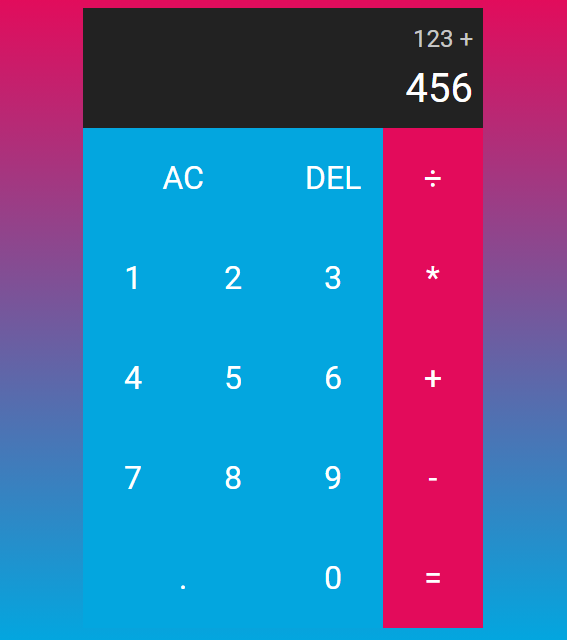

# Projeto Calculadora JS
- Projeto simples de calculadora criado acompanhando a video aula do canal Felipe Rocha - dicaparadevs. (https://www.youtube.com/@dicasparadevs)

## Print
- Versão desktop

## Link

- Live Site: https://teoniuvilarinho.github.io/projeto-calculadora-js/
